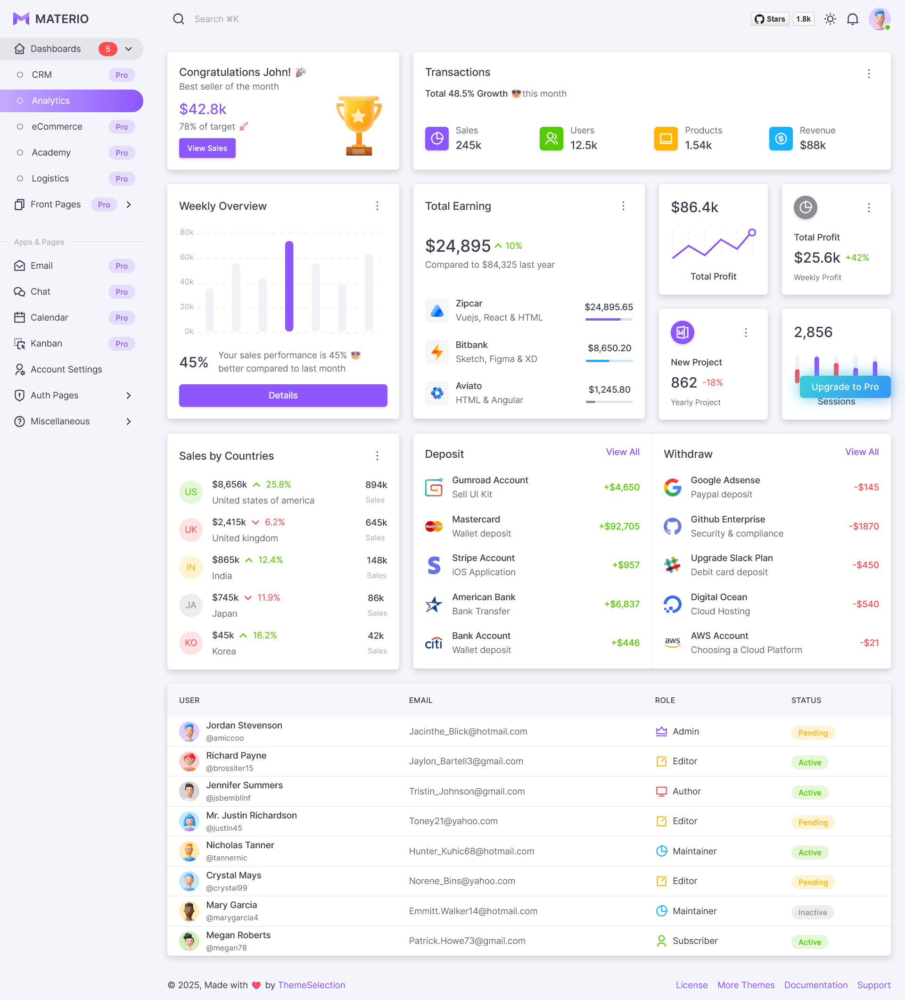

# Materio Dashboard UI Upgrade Plan

## 1. Goal

To incrementally upgrade the existing dashboard UI by adopting design elements, styling, and components from the Materio MUI Next.js Admin Template ([https://github.com/themeselection/materio-mui-nextjs-admin-template-free](https://github.com/themeselection/materio-mui-nextjs-admin-template-free)). The primary objective is to enhance visual aesthetics and user experience **without altering existing functionality or introducing regressions.**

## 2. Guiding Principles

*   **Incremental Adoption:** Changes will be made in small, manageable phases.
*   **Risk Mitigation:** Prioritize low-risk visual updates first. Complex structural changes or direct component replacements from Materio will be approached cautiously.
*   **Functionality Preservation:** Every UI change must be verified to ensure no underlying functionality is broken.
*   **Consistency:** Strive for a consistent look and feel across updated sections.
*   **Targeted Changes:** Focus on one component type or layout section at a time.

## 3. Preparation

1.  **Familiarization:** Thoroughly review the Materio free template's demo, codebase (especially `typescript-version`), theme structure (`src/theme`), layout components (`src/layouts`, `src/components/layout`), and common UI patterns.
2.  **Current Project Audit:** Identify key layout files in our project (e.g., `src/app/(dashboard)/layout.tsx`, `src/components/layouts/DashboardMainLayout.tsx`, `SideDrawerContent.tsx`) and common UI components that are candidates for restyling.
3.  **Theme Analysis:** Compare Materio's MUI theme (palette, typography, spacing, component overrides) with our current theme (`src/theme/index.ts`, `src/theme/overrides/`).

## 4. Phased Implementation Plan

### Phase 0: Setup & Basic Theming

*   **Action:** Integrate Materio's core theme settings (color palette, typography, spacing units) into our existing MUI theme (`src/theme/index.ts`).
*   **Details:**
    *   Define primary, secondary, success, error, warning, info colors based on Materio.
    *   Update typography variants if Materio offers a more refined set.
    *   Adjust global styles for consistency (e.g., body background).
*   **Verification:** Check overall application for consistent color and font application. Ensure no visual regressions on pages not yet actively being restyled.

### Phase 1: Dashboard Shell (Navigation & Main Layout)

*   **Status: Complete**
*   **Key Visual Reference:**
    *    *(Image to be manually added by the user to `docs/images/materio_dashboard_reference.png`)*

*   **Target Files:**
    *   `src/app/(dashboard)/layout.tsx`
    *   `src/components/layouts/DashboardMainLayout.tsx`
    *   `src/components/layouts/SideDrawerContent.tsx` (and variants like `AdminSideDrawerContent.tsx`, `ProviderSideDrawerContent.tsx` if they are to be updated similarly later)
*   **Action:** Restyle the main dashboard navigation (sidebar/drawer) and header/app-bar to align with Materio's look and feel.
*   **Details:**
    *   Update the `AppBar` and `Drawer` components' styling.
    *   Adjust layout spacing and padding for the main content area.
    *   Restyle navigation links/items.
*   **Verification:** Ensure navigation remains fully functional. Check responsiveness.

### Phase 2: Common UI Components (Global Styles)

*   **STATUS: ON HOLD (Effective 2024-05-14)** - The team has decided to temporarily pause the direct implementation of Materio common UI component styles (Buttons, Cards, TextFields, etc.) due to complexities encountered with theme integration (`experimental_extendTheme` and CSS variable propagation for shadows). The focus will be on ensuring stability with the current theme system. The Avatar implementation part of this phase has been completed.

*   **New Functionality: Avatar Implementation (Completed)**
    *   **Goal:** Introduce user profile avatars.
    *   **Assignment:** On login, if a user doesn't have an avatar, assign a random image from `public/images/avatar`.
    *   **User Control:** Allow users to select a new avatar from the available images in `public/images/avatar` within their profile editing section.
    *   **Storage:** The selected avatar preference (e.g., filename) should be stored in the user's profile data (e.g., in the `profiles` table or `users` table metadata).
    *   **Display:** Avatars should be displayed in relevant UI locations (e.g., profile dropdown menu, user profile page).

*   **Target Files:** `src/theme/overrides/` (e.g., `card.ts`, `button.ts`, `input.ts`)
*   **Action:** Update the default styling for common MUI components used throughout the dashboard to match Materio's aesthetic.
*   **Details:**
    *   `Button`: Variants, padding, border-radius.
    *   `Card`: Elevation, border-radius, header/content styling.
    *   `TextField`, `Select`: Input field appearance.
    *   `Alerts`, `Badges`, `Chips`.
*   **Verification:** Review various pages to see that these components now reflect Materio's styling consistently. Check forms and interactive elements.

### Phase 3: Specific Dashboard Page Enhancements (Iterative)

*   **Target Pages (Examples):**
    *   `/dashboard` (main overview)
    *   `/dashboard/profile`
    *   `/dashboard/appointments`
    *   `/dashboard/education` (and its detail page)
*   **Action:** For each key page (or type of page), review its specific layout and components. Apply Materio-inspired styling and, where appropriate and low-risk, refactor UI elements to use Materio's patterns.
*   **Details:**
    *   This will be an iterative process, page by page or section by section.
    *   Focus on improving information density, clarity, and visual hierarchy.
    *   Example: If Materio has a well-designed user profile card, adapt its style for our `/dashboard/profile` page.
*   **Verification:** Page-specific functional testing and visual review after each update.

### Phase 4: Advanced Components & Customization (Optional & Cautious)

*   **Action:** Consider integrating more complex or custom components from Materio if they offer significant UI/UX benefits and can be adapted without major refactoring of existing logic.
*   **Details:**
    *   Examples: Custom charts, tables with advanced features, specific widgets.
    *   This phase requires careful evaluation of the component's dependencies and integration effort.
*   **Verification:** Rigorous functional and visual testing.

## 5. Testing Strategy

*   **Visual Checks:** After each significant change, manually review affected pages/components across common viewport sizes.
*   **Functional Testing:** Verify all existing functionalities related to the updated UI (e.g., button clicks, form submissions, navigation, data display).
*   **Cross-Browser Testing:** Periodically check on major browsers (Chrome, Firefox, Edge, Safari).
*   **Console Checks:** Monitor the browser console for any new errors or warnings.

## 6. Version Control

*   Commit changes frequently with clear messages.
*   Create branches for significant phases or features to isolate changes and facilitate rollbacks if necessary.

## 7. Future Considerations (Post Initial Upgrade)

*   Applying similar upgrades to Admin and Provider dashboard layouts if desired.
*   Exploring Materio's utility components or custom hooks if beneficial.

## Phase X: Structural Refactor (Post-Materio Implementation)

Consider a structural refactor to a `BaseDashboardLayout` component after the initial Materio UI visual and stylistic implementation is complete across all dashboards.

**Rationale:**
*   A very large portion of the JSX structure (beyond just styles) for the `AppBar` and `Drawer` shell is, or will become, identical across the Admin, Patient (Dashboard), and Provider layouts.
*   The behavioral logic (like handling drawer toggling, collapse states, user menu interactions) is also highly similar.
*   The primary differences are constrained to the *content* (e.g., navigation links specific to each role, `AppBar` titles, and role-specific action icons in the `AppBar`).

**Proposed Approach:**
*   **Create `BaseDashboardLayout`:** This component would encapsulate all common structural JSX (for the `AppBar` shell, `Drawer` shell, main content area) and common behavioral logic. It would also include the shared Materio styling applied during the initial phases.
*   **Props for Specifics:** The `BaseDashboardLayout` would accept props for role-specific parts. Examples include:
    *   A prop to pass the array of navigation items or a component that renders the navigation list for the drawer.
    *   A prop for the `AppBar` title.
    *   Props for any custom action icons or components to be rendered in the `AppBar`.
*   **Simplify Existing Layouts:** The individual `AdminLayout.tsx`, `src/app/(dashboard)/layout.tsx` (Patient), and `src/components/layouts/ProviderMainLayout.tsx` would then become simpler wrappers. Their main responsibility would be to:
    1.  Use the `BaseDashboardLayout`.
    2.  Provide the role-specific data and components to it via props.
    3.  Handle any truly unique layout logic that cannot be generalized into the `BaseDashboardLayout`.

**Benefits:**
*   **Improved Maintainability:** Changes to common layout structures or styles would only need to be made in one place (`BaseDashboardLayout`).
*   **Reduced Code Duplication:** Significantly reduces repeated JSX and logic across the different dashboard layouts.
*   **Increased Consistency:** Enforces a consistent shell structure and behavior by default. 